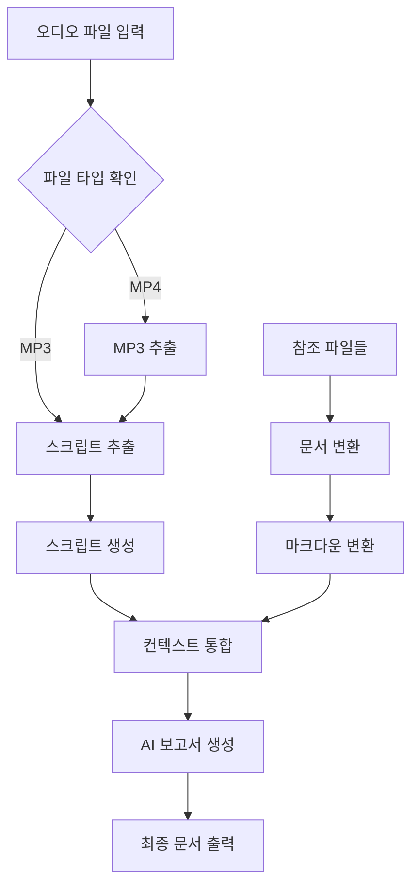

# Video2Doc Agent System

smolagents를 기반으로 한 동영상 및 참조 자료 문서화 에이전트 시스템

## 📖 개요

Video2Doc Agent는 교육 동영상과 관련 참조 자료를 자동으로 분석하여 구조화된 문서를 생성하는 AI 에이전트 시스템입니다. Hugging Face의 smolagents 프레임워크를 사용하여 구축되었습니다.

## 🌟 주요 기능

- **🎬 동영상 처리**: MP4, AVI, MOV, MKV 형식 지원
- **🎵 오디오 처리**: MP3 파일 직접 처리 지원 (회의록 등에 유용)
- **🎵 오디오 추출**: FFmpeg를 사용한 고품질 오디오 추출
- **🗣️ 음성 인식**: Whisper large-v3 모델을 사용한 정확한 음성-텍스트 변환
- **📄 문서 변환**: PDF, PPTX, DOCX, 이미지 파일을 마크다운으로 변환
- **🖼️ OCR 처리**: 이미지에서 텍스트 추출
- **🤖 AI 문서 생성**: 컨텍스트를 기반으로 한 지능적인 보고서 생성
- **⚙️ 유연한 설정**: 다양한 모델과 출력 형식 지원

## 🛠️ 시스템 워크플로우



## 📋 요구사항

### 시스템 요구사항
- Python 3.8 이상
- FFmpeg (오디오/비디오 처리용)
- Tesseract OCR (이미지 텍스트 추출용)

### Python 패키지
```bash
pip install -r requirements.txt
```

### 필수 의존성
- smolagents>=0.3.0
- whisper>=20231117
- litellm>=1.0.0
- PyMuPDF>=1.23.0
- python-pptx>=0.6.0
- python-docx>=0.8.0
- pytesseract>=0.3.10
- 기타 (requirements.txt 참조)

## 🚀 설치 및 설정

### 1. 저장소 클론
```bash
git clone <repository-url>
cd video2doc
```

### 2. 의존성 설치
```bash
pip install -r requirements.txt
```

### 3. 시스템 도구 설치

#### Ubuntu/Debian:
```bash
sudo apt-get update
sudo apt-get install ffmpeg tesseract-ocr tesseract-ocr-kor
```

#### macOS:
```bash
brew install ffmpeg tesseract tesseract-lang
```

#### Windows:
- [FFmpeg 다운로드](https://ffmpeg.org/download.html)
- [Tesseract 다운로드](https://github.com/UB-Mannheim/tesseract/wiki)

### 4. Ollama 설정 (로컬 LLM 사용 시)
```bash
# Ollama 설치 및 모델 다운로드
curl -fsSL https://ollama.ai/install.sh | sh
ollama pull qwen3:custom
```

## 💻 사용법

### 파일 준비

1. **오디오 파일을 `input/` 폴더에 배치**:
   ```bash
   # MP4 동영상 파일 또는 MP3 오디오 파일을 input 폴더에 복사
   cp your_video.mp4 input/
   # 또는
   cp your_audio.mp3 input/
   ```

2. **참조 파일들도 `input/` 폴더에 배치**:
   ```bash
   # 참조 문서들을 input 폴더에 복사
   cp slides.pptx notes.pdf diagram.png input/
   ```

### 명령행 인터페이스

#### 기본 사용법:
```bash
# MP4 동영상 파일 처리
python main.py --audio input/lecture.mp4 --type summary --length mid

# MP3 오디오 파일 처리
python main.py --audio input/meeting.mp3 --type summary --length mid
```

#### 참조 파일과 함께:
```bash
# MP4 동영상 + 참조 파일들
python main.py --audio input/presentation.mp4 --refs input/slides.pptx input/notes.pdf --type detailed --length long

# MP3 오디오 + 참조 파일들 (회의록 등에 유용)
python main.py --audio input/meeting.mp3 --refs input/agenda.pdf --type summary --length short
```

#### 고급 옵션:
```bash
python main.py \
    --audio input/tutorial.mp4 \
    --refs input/manual.pdf input/diagram.png \
    --type presentation \
    --length long \
    --model local_deepseek \
    --output /path/to/output \
    --verbose
```

### Python API 사용

#### 간단한 예시:
```python
from video2doc_agent import Video2DocAgent

# 에이전트 초기화
agent = Video2DocAgent()

# MP4 동영상 처리
result = agent.process_audio_and_references(
    audio_path="input/lecture.mp4",
    reference_files=["input/slides.pptx", "input/notes.pdf"],
    report_type="summary",
    length="mid"
)

# MP3 오디오 처리 (회의록 등)
result = agent.process_audio_and_references(
    audio_path="input/meeting.mp3",
    reference_files=["input/agenda.pdf"],
    report_type="summary",
    length="short"
)

print(f"결과: {result}")
```

#### 커스텀 설정:
```python
from video2doc_agent import Video2DocAgent

# 커스텀 모델 설정
model_config = {
    "model_id": "ollama_chat/qwen3:custom",
    "api_base": "http://localhost:11434",
    "num_ctx": 32768,
}

# 에이전트 초기화
agent = Video2DocAgent(model_config=model_config)

# MP4 처리
result = agent.process_audio_and_references(
    audio_path="input/educational_video.mp4",
    reference_files=["input/textbook.pdf", "input/slides.pptx"],
    report_type="detailed",
    length="long"
)

# MP3 처리 (회의록 등)
result = agent.process_audio_and_references(
    audio_path="input/meeting_recording.mp3",
    reference_files=["input/meeting_agenda.pdf"],
    report_type="summary",
    length="mid"
)
```

### 단계별 처리:
```python
from video2doc_agent import Video2DocWorkflow

workflow = Video2DocWorkflow()

# 1. MP3 추출 (MP4인 경우만)
mp3_file = workflow.extract_mp3_from_mp4("input/video.mp4")

# 2. 스크립트 추출 (MP4에서 추출된 MP3 또는 직접 입력된 MP3)
script_file = workflow.extract_script_from_mp3("input/audio.mp3")

# 3. 문서 변환 (input 폴더의 참조 파일들 사용)
pdf_md = workflow.convert_reference_file_to_md("input/reference.pdf")
pptx_md = workflow.convert_reference_file_to_md("input/slides.pptx")
```

## ⚙️ 설정 옵션

### 모델 설정
- `default`: 기본 로컬 모델 (qwen3:custom)
- `local_qwen`: Qwen 모델 (Ollama)
- `local_deepseek`: DeepSeek 모델 (Ollama)
- `openai_gpt4`: OpenAI GPT-4 (API 키 필요)

### 보고서 유형
- `summary`: 요약 보고서
- `detailed`: 상세 분석 보고서
- `presentation`: 프레젠테이션 형태

### 보고서 길이
- `short`: 간단 (1페이지)
- `mid`: 중간 (소주제별 1페이지)
- `long`: 상세 (소주제별 2페이지 이상)

### 지원 파일 형식
- **동영상**: MP4, AVI, MOV, MKV
- **오디오**: MP3 (직접 입력 지원)
- **문서**: PDF, PPTX, DOCX
- **이미지**: JPG, JPEG, PNG, BMP

## 📁 출력 구조

```
output/
├── 02_audio_name.mp3              # 추출된 오디오 (MP4인 경우만)
├── 03_audio_name_script.md        # 음성인식 스크립트
├── 04_reference_ref.md            # 변환된 참조 문서
├── 05_audio_name_full_context.md  # 통합 컨텍스트
└── 06_audio_name_summary_mid.md   # 최종 보고서
```

## 🔧 개발자 가이드

### 프로젝트 구조
```
video2doc/
├── input/                 # 입력 파일 디렉토리 (비디오 + 참조 파일)
│   ├── S2_02.mp4         # 샘플 비디오 파일
│   ├── Resume.pdf        # 샘플 참조 문서
│   ├── rules.pdf         # 샘플 참조 문서
│   └── RESULT_GASTRO.xlsx # 샘플 데이터 파일
├── output/               # 출력 파일 디렉토리
├── video2doc_agent.py    # 메인 에이전트 클래스
├── config.py             # 설정 파일
├── main.py               # 명령행 인터페이스
├── example_usage.py      # 사용 예시
├── requirements.txt      # 패키지 의존성
├── README.md            # 이 파일
├── agent.md             # 워크플로우 설명
├── prd.md                # 제품 요구사항
└── sample_code.py        # 원본 워크플로우 코드
```

### 커스텀 도구 추가
```python
from smolagents import tool

@tool
def custom_processing_tool(input_data: str) -> str:
    """커스텀 처리 도구"""
    # 처리 로직 구현
    return processed_data

# 에이전트에 도구 추가
agent = Video2DocAgent()
agent.agent.tools.append(custom_processing_tool)
```

### 설정 커스터마이징
```python
from config import Config

class CustomConfig(Config):
    WHISPER_MODEL = "medium"
    DEFAULT_MODEL_CONFIG = {
        "model_id": "your-custom-model",
        "api_base": "http://your-api-endpoint",
    }
```

## 🐛 문제 해결

### 일반적인 문제들

#### 1. FFmpeg 오류
```bash
# FFmpeg 설치 확인
ffmpeg -version

# 경로 문제 시
export PATH="/usr/local/bin:$PATH"
```

#### 2. Whisper 모델 다운로드 오류
```bash
# 수동 모델 다운로드
python -c "import whisper; whisper.load_model('large-v3')"
```

#### 3. Tesseract OCR 오류
```bash
# Tesseract 설치 확인
tesseract --version

# 한국어 언어팩 설치
sudo apt-get install tesseract-ocr-kor
```

#### 4. 메모리 부족 오류
- 더 작은 Whisper 모델 사용 (`medium`, `small`)
- 컨텍스트 윈도우 크기 줄이기
- 배치 처리로 분할

### 로그 확인
```bash
# 상세 로그와 함께 실행
python main.py --video video.mp4 --verbose

# 로그 파일 확인
tail -f output/video2doc.log
```

## 📊 성능 최적화

### 하드웨어 권장사항
- **CPU**: 8코어 이상
- **RAM**: 16GB 이상 (Whisper large-v3 사용 시)
- **GPU**: CUDA 지원 GPU (선택적, Whisper 가속화용)
- **저장공간**: 처리할 파일 크기의 3-5배

### 성능 튜닝
```python
# 빠른 처리를 위한 설정
config = {
    "model_id": "ollama_chat/qwen3:custom",
    "num_ctx": 8192,  # 작은 컨텍스트
    "temperature": 0.3,  # 빠른 생성
}

# Whisper 모델 변경
WHISPER_MODEL = "medium"  # 또는 "small"
```

## 🤝 기여하기

1. Fork the repository
2. Create a feature branch (`git checkout -b feature/amazing-feature`)
3. Commit your changes (`git commit -m 'Add some amazing feature'`)
4. Push to the branch (`git push origin feature/amazing-feature`)
5. Open a Pull Request

## 📄 라이센스

이 프로젝트는 MIT 라이센스 하에 배포됩니다. 자세한 내용은 [LICENSE](LICENSE) 파일을 참조하세요.

## 📞 지원 및 문의

- **이슈 리포트**: [GitHub Issues](https://github.com/your-repo/video2doc/issues)
- **문서**: [Documentation](https://your-docs-site.com)
- **이메일**: support@your-domain.com

## 🙏 감사의 말

- [smolagents](https://github.com/huggingface/smolagents) - Hugging Face의 훌륭한 에이전트 프레임워크
- [Whisper](https://github.com/openai/whisper) - OpenAI의 음성인식 모델
- [FFmpeg](https://ffmpeg.org/) - 강력한 멀티미디어 프레임워크
- [Tesseract](https://github.com/tesseract-ocr/tesseract) - 오픈소스 OCR 엔진

---

**Video2Doc Agent** - 교육 컨텐츠의 자동 문서화를 통해 학습 효율성을 높입니다. 🚀

## 🧪 전체 워크플로우 테스트

현재까지 구현된 Video2Doc 시스템의 전체 워크플로우를 테스트할 수 있습니다.

### 테스트 준비

1. **의존성 설치**:
   ```bash
   pip install -r requirements.txt
   ```

2. **테스트 파일 준비**:
   ```bash
   python prepare_test.py
   ```

3. **실제 비디오 파일 사용 (선택사항)**:
   - `input/S2_02.mp4` 위치에 실제 MP4 파일 배치
   - 더미 파일 대신 실제 비디오로 테스트 가능

### 테스트 실행

#### 방법 1: 스크립트 사용 (권장)
```bash
./run_test.sh
```

#### 방법 2: Python 직접 실행
```bash
python test_workflow.py
```

### 테스트 과정

1. **오디오 처리**: 
   - MP4인 경우: FFmpeg를 사용한 오디오 추출
   - MP3인 경우: 직접 처리
2. **음성 인식**: Hugging Face Whisper로 스크립트 생성
3. **문서 변환**: markitdown으로 참조 파일 변환
4. **컨텍스트 통합**: 모든 내용을 하나의 문서로 통합
5. **보고서 생성**: 최종 분석 보고서 생성

### 테스트 결과

- 결과는 `test_output/test_session_YYYYMMDD_HHMMSS/` 디렉토리에 저장
- 각 단계별 결과 파일과 로그 생성
- 실행 시간 및 성공/실패 상태 확인

### 지원 파일 형식

- **동영상**: MP4
- **오디오**: MP3 (직접 입력 지원)
- **참조 문서**: PDF, PPTX, DOCX, XLSX, TXT, MD
- **이미지**: JPG, PNG, BMP, GIF, TIFF, WebP
