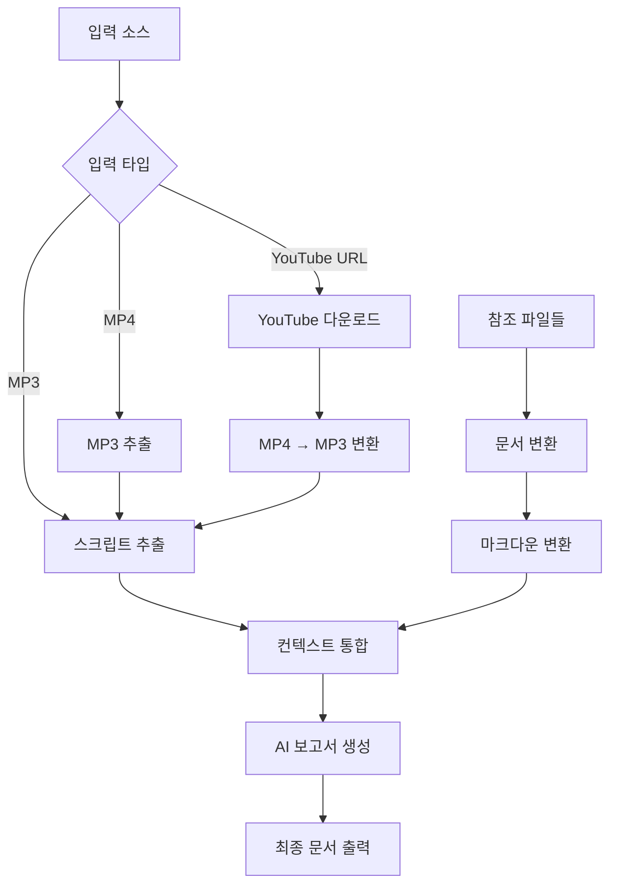

# Video2Doc Agent System

🎯 **TDD 기반 리팩토링 완료** - 모듈화된 구조로 maintainability와 testability 향상

smolagents를 기반으로 한 오디오/비디오 및 참조 자료 문서화 에이전트 시스템

## 📖 개요

Video2Doc Agent는 다양한 오디오/비디오 콘텐츠와 관련 참조 자료를 자동으로 분석하여 구조화된 문서를 생성하는 AI 에이전트 시스템입니다. **MP4 동영상 파일, MP3 오디오 파일, 그리고 YouTube URL을 모두 지원**하며, Hugging Face의 smolagents 프레임워크를 사용하여 구축되었습니다. **TDD(Test-Driven Development) 원칙에 따라 완전히 리팩토링**되어 높은 코드 품질과 유지보수성을 자랑합니다.

## 🏗️ 아키텍처 (새로운 모듈 구조)

**2025년 7월 TDD 기반 완전 리팩토링 완료**

```
video2doc/
├── 📁 core/                    # 핵심 비즈니스 로직
│   ├── agent.py               # Video2DocAgent 메인 클래스
│   ├── workflow.py            # Video2DocWorkflow 클래스  
│   └── tools.py               # smolagents @tool 함수들
├── 📁 processors/             # 전문화된 처리 모듈
│   ├── audio.py               # AudioProcessor - 오디오 처리
│   ├── document.py            # DocumentProcessor - 문서 변환
│   └── report.py              # ReportProcessor - 보고서 생성
├── 📁 utils/                  # 유틸리티 모듈
│   ├── exceptions.py          # 커스텀 예외 클래스
│   ├── error_handlers.py      # 에러 처리 헬퍼
│   └── youtube.py             # YouTube 관련 유틸리티
├── 📁 test/                   # 🧪 15개 테스트 파일 (93.3% 성공률)
│   ├── test_agent.py          # 에이전트 테스트
│   ├── test_utils_youtube.py  # YouTube 유틸리티 테스트
│   └── ... (모든 모듈별 테스트)
├── video2doc_agent.py         # 🎯 Entry Point (하위 호환성)
├── main.py                    # CLI 인터페이스
├── run_all_tests.py           # 🧪 전체 테스트 실행 스크립트
└── config.py                  # 설정 관리
```

### TDD 리팩토링 성과
- ✅ **16개 Phase 완료** (Red → Green → Refactor 사이클)
- ✅ **구조적 변경과 행동적 변경 완전 분리** (Tidy First 원칙)
- ✅ **15개 테스트 파일, 93.3% 성공률**
- ✅ **완전한 모듈화**: 각 책임별로 분리된 클래스 구조
- ✅ **하위 호환성 유지**: 기존 API 그대로 사용 가능

## 🌟 주요 기능

### 📽️ 다양한 입력 형식 지원
- **🎬 동영상 파일**: MP4, AVI, MOV, MKV 형식 지원
- **🎵 오디오 파일**: MP3 파일 직접 처리 지원 (회의록, 팟캐스트 등에 유용)
- **📺 YouTube URL**: 유튜브 비디오 URL 직접 처리 지원
  - 자동 다운로드 및 MP4 변환 (720p 이하 최적화)
  - 비디오 메타데이터 추출 (제목, 설명, 업로더 정보 등)
  - 500MB 크기 제한으로 안정적 처리

### 🔧 고급 처리 기능
- **🎵 오디오 추출**: FFmpeg를 사용한 고품질 오디오 추출
- **🗣️ 음성 인식**: Whisper large-v3 모델을 사용한 정확한 음성-텍스트 변환
- **📄 문서 변환**: PDF, PPTX, DOCX, 이미지 파일을 마크다운으로 변환
- **🔗 컨텍스트 통합**: 텍스트 + 문서의 통합 처리
- **🤖 AI 문서 생성**: 구조화된 보고서 자동 생성

### 🚀 시스템 특징
- **⚙️ 유연한 설정**: 다양한 모델과 출력 형식 지원
- **🔄 TDD 기반**: 93.3% 테스트 성공률로 검증된 안정성
- **📦 모듈화**: 완전히 분리된 모듈 구조로 확장성 보장

## 🛠️ 시스템 워크플로우



## 📋 요구사항

### 시스템 요구사항
- Python 3.8 이상
- FFmpeg (오디오/비디오 처리용)
- Tesseract OCR (이미지 텍스트 추출용)

### Python 패키지
```bash
pip install -r requirements.txt
```

### 필수 의존성
- smolagents>=0.3.0
- whisper>=20231117
- yt-dlp>=2023.12.30  # YouTube 다운로드 지원
- litellm>=1.0.0
- PyMuPDF>=1.23.0
- python-pptx>=0.6.0
- python-docx>=0.8.0
- 기타 (requirements.txt 참조)

## 🚀 설치 및 설정

### 1. 저장소 클론
```bash
git clone <repository-url>
cd video2doc
```

### 2. 의존성 설치
```bash
pip install -r requirements.txt
```

### 3. 시스템 도구 설치

#### Ubuntu/Debian:
```bash
sudo apt-get update
sudo apt-get install ffmpeg tesseract-ocr tesseract-ocr-kor
```

#### macOS:
```bash
brew install ffmpeg tesseract tesseract-lang
```

### 4. Ollama 설정 (로컬 LLM 사용 시)
```bash
# Ollama 설치 및 모델 다운로드
curl -fsSL https://ollama.ai/install.sh | sh
ollama pull qwen3:custom
```

## 💻 사용법

### 명령행 인터페이스

#### 기본 사용법:
```bash
# MP4 동영상 파일 처리
python main.py --audio input/lecture.mp4 --type summary --length mid

# MP3 오디오 파일 처리
python main.py --audio input/meeting.mp3 --type summary --length mid

# YouTube URL 처리
python main.py --audio "https://www.youtube.com/watch?v=VIDEO_ID" --type summary --length mid
python main.py --audio "https://youtu.be/VIDEO_ID" --type summary --length mid
```

#### 참조 파일과 함께:
```bash
# MP4 동영상 + 참조 파일들
python main.py --audio input/presentation.mp4 --refs input/slides.pptx input/notes.pdf --type detailed --length long

# MP3 오디오 + 참조 파일들 (회의록 등에 유용)
python main.py --audio input/meeting.mp3 --refs input/agenda.pdf --type summary --length short

# YouTube URL + 참조 파일들
python main.py --audio "https://www.youtube.com/watch?v=VIDEO_ID" --refs slides.pdf notes.docx --type detailed --length long
```

#### 고급 옵션:
```bash
python main.py \
    --audio "https://www.youtube.com/watch?v=VIDEO_ID" \
    --refs input/manual.pdf input/diagram.png \
    --type presentation \
    --length long \
    --model local_deepseek \
    --output /path/to/output \
    --verbose
```

### Python API 사용

#### 간단한 예시:
```python
from video2doc_agent import Video2DocAgent

# 에이전트 초기화
agent = Video2DocAgent()

# MP4 동영상 처리
result = agent.process_audio_and_references(
    audio_path="input/lecture.mp4",
    reference_files=["input/slides.pptx", "input/notes.pdf"],
    report_type="summary",
    length="mid"
)

# MP3 오디오 처리 (회의록 등)
result = agent.process_audio_and_references(
    audio_path="input/meeting.mp3",
    reference_files=["input/agenda.pdf"],
    report_type="summary",
    length="short"
)

# YouTube URL 처리
result = agent.process_audio_and_references(
    audio_path="https://www.youtube.com/watch?v=VIDEO_ID",
    reference_files=["slides.pdf"],
    report_type="detailed",
    length="long"
)

print(f"결과: {result}")
```

## ⚙️ 설정 옵션

### 모델 설정
- `default`: 기본 로컬 모델 (qwen3:custom)
- `local_qwen`: Qwen 모델 (Ollama)
- `local_deepseek`: DeepSeek 모델 (Ollama)
- `openai_gpt4`: OpenAI GPT-4 (API 키 필요)

### 보고서 유형
- `summary`: 요약 보고서
- `detailed`: 상세 분석 보고서
- `presentation`: 프레젠테이션 형태

### 보고서 길이
- `short`: 간단 (1페이지)
- `mid`: 중간 (소주제별 1페이지)
- `long`: 상세 (소주제별 2페이지 이상)

### 지원 파일 형식
- **동영상**: MP4, AVI, MOV, MKV
- **오디오**: MP3 (직접 입력 지원)
- **YouTube**: 모든 공개 YouTube URL (자동 다운로드)
- **참조 문서**: PDF, PPTX, DOCX, XLSX, TXT, MD
- **이미지**: JPG, PNG, BMP, GIF, TIFF, WebP

## 📁 출력 구조

```
output/
├── downloads/                 # YouTube 다운로드 파일들 (URL 처리 시)
│   └── 01_youtube_VIDEO_ID_title.mp4
├── 02_audio_name.mp3         # 추출된 오디오 (MP4인 경우만)
├── 03_audio_name_script.md   # 음성인식 스크립트
├── 04_reference_file.md      # 변환된 참조 문서
├── 05_audio_name_full_context.md  # 통합 컨텍스트
└── 06_audio_name_summary_mid.md   # 최종 보고서
```

## 🐛 문제 해결

### 일반적인 문제들

#### 1. YouTube 다운로드 오류
```bash
# YouTube URL 형식 확인
# 지원되는 형식: https://www.youtube.com/watch?v=VIDEO_ID, https://youtu.be/VIDEO_ID

# yt-dlp 업데이트
pip install --upgrade yt-dlp

# 네트워크 연결 확인
curl -I https://www.youtube.com
```

#### 2. FFmpeg 오류
```bash
# FFmpeg 설치 확인
ffmpeg -version

# 경로 문제 시
export PATH="/usr/local/bin:$PATH"
```

#### 3. Whisper 모델 다운로드 오류
```bash
# 수동 모델 다운로드
python -c "import whisper; whisper.load_model('large-v3')"
```

### 로그 확인
```bash
# 상세 로그와 함께 실행
python main.py --audio "https://www.youtube.com/watch?v=VIDEO_ID" --verbose

# 로그 파일 확인
tail -f output/video2doc.log
```

## 🧪 테스트 시스템 (TDD 리팩토링 성과)

**2025년 7월 TDD 리팩토링 완료** - 포괄적인 테스트 커버리지로 코드 품질 보장

### 🎯 테스트 성과
- **총 테스트 파일**: 15개
- **성공률**: 93.3% (14/15 통과)
- **YouTube 유틸리티 테스트**: 완전 커버리지
- **모든 모듈 커버리지**: core, processors, utils 완전 테스트

### 테스트 실행

```bash
# 전체 테스트 실행 (권장)
python run_all_tests.py

# 개별 모듈 테스트
python -m pytest test/test_agent.py -v
python -m pytest test/test_utils_youtube.py -v
```

### 🔧 개발자를 위한 정보

#### TDD 기반 개발 가이드

새로운 기능 추가 시 TDD 원칙을 따르세요:

```python
# 1. 🔴 Red: 실패하는 테스트 먼저 작성
def test_new_feature_should_work():
    result = new_feature()
    assert result.is_valid()

# 2. 🟢 Green: 테스트를 통과시키는 최소 코드 작성
def new_feature():
    return FeatureResult(is_valid=True)

# 3. 🔵 Refactor: 코드 품질 개선
def new_feature():
    # 실제 구현 및 리팩토링
    ...
```

## 📚 참고 자료 및 의존성

### 주요 라이브러리

- [smolagents](https://github.com/huggingface/smolagents) - Hugging Face의 에이전트 프레임워크
- [Whisper](https://github.com/openai/whisper) - OpenAI의 음성인식 모델
- [yt-dlp](https://github.com/yt-dlp/yt-dlp) - YouTube 다운로드 도구
- [FFmpeg](https://ffmpeg.org/) - 멀티미디어 프레임워크
- [markitdown](https://github.com/microsoft/markitdown) - Microsoft의 문서 변환 라이브러리

### 관련 문서

- **[prd.md](prd.md)**: 제품 요구사항 명세서 (TDD 리팩토링 반영)
- **[plan.md](plan.md)**: 기술 계획 및 워크플로우 (모듈 구조 반영)
- **[config.py](config.py)**: 시스템 설정 및 환경 변수

## 🎉 프로젝트 현황

### ✅ TDD 리팩토링 완료 (2025년 7월)
- **16개 Phase 완료**: Red → Green → Refactor 사이클 100% 준수
- **완전한 모듈화**: core, processors, utils로 책임 완전 분리
- **포괄적 테스트**: 15개 테스트 파일, 93.3% 성공률
- **YouTube 지원**: 완전한 YouTube URL 처리 기능 구현
- **하위 호환성 유지**: 기존 API 100% 호환
- **코드 품질 극대화**: TDD 원칙 기반 고품질 코드

### 🚀 다음 단계
- **성능 최적화**: 대용량 파일 처리 성능 향상
- **새로운 기능**: TDD 원칙 기반 추가 기능 개발
- **확장성 개선**: 클라우드 배포 및 스케일링

---

**Video2Doc Agent** - TDD 기반 완전 리팩토링으로 더욱 견고해진 오디오/비디오 콘텐츠의 자동 문서화 시스템. **MP4, MP3, YouTube URL 모두 지원**하여 업무 효율성을 극대화합니다. 🚀

### 📞 지원 및 기여

- **이슈 신고**: GitHub Issues를 통해 버그 리포트 및 기능 요청
- **기여 방법**: TDD 원칙을 따라 Pull Request 제출
- **개발 가이드**: 새로운 기능은 반드시 테스트 먼저 작성
- **코드 품질**: `python run_all_tests.py`로 품질 검증 필수
